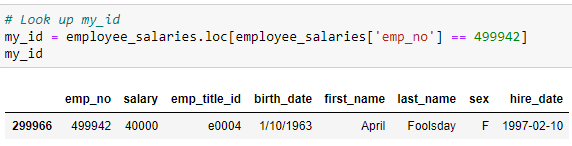

# Employee Database

## Introduction

It is a beautiful spring day, and it is two weeks since you have been hired as a new data engineer at Pewlett Hackard. Your first major task is a research project on employees of the corporation from the 1980s and 1990s. All that remain of the database of employees from that period are six CSV files.

## Step 1: System Requirements

PostgreSQL Version 10+

## Step 2: Installation

Download on https://www.postgresql.org/ and open with PGAdmin4

## Step 3: Data Engineering

After creating the tables from the <strong>table_schemata.sql file</strong> and populating them with the csv files from the resources folder we can begin data analysis.

## Step 4: Data Analysis

1.) List the following details of each employee: employee number, last name, first name, sex, and salary.\
\
2.) List first name, last name, and hire date for employees who were hired in 1986.\
\
3.) List the manager of each department with the following information: department number, department name, the manager's employee number, last name, first name.\
\
4.) List the department of each employee with the following information: employee number, last name, first name, and department name.\
\
5.)List first name, last name, and sex for employees whose first name is "Hercules" and last names begin with "B."\
\
6.) List all employees in the Sales department, including their employee number, last name, first name, and department name.\
\
7.) List all employees in the Sales and Development departments, including their employee number, last name, first name, and department name.\
\
8.) In descending order, list the frequency count of employee last names, i.e., how many employees share each last name.\
\

## ERD

Demonstrate Data Modeling by inspecting the provided CSV and sketching an Entity-Relationship-Diagram (ERD).\

## Bonus

As I've examined the data, I was overcome with a creeping suspicion that the dataset is fake. I surmised that my boss handed me spurious data in order to test the data engineering skills of a new employee. To confirm my hunch, I decided to take the following steps to generate a visualization of the data, with which I will confront your boss

A histogram to visualize the most common salary ranges for employees.
\
A bar chart of average salary by title.\
\

## Epilogue

Evidence in hand, I marched into my boss's office and presented the visualization. With a sly grin, my boss thanks me for my work. On my way out of the office, I hear the words, "Search your ID number." I look down at my badge to see that my employee ID number is 499942.\
\
